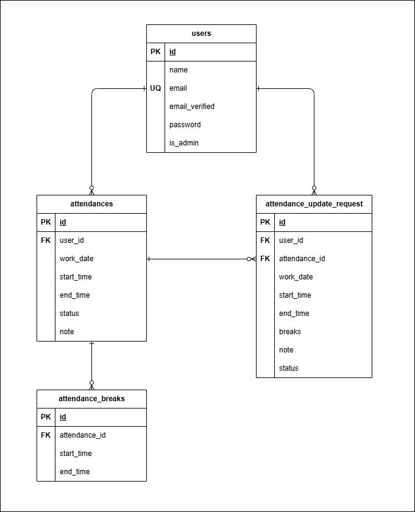

# attendance-app (coachtech 勤怠管理アプリ)

## 環境構築


**Dockerビルド手順**

1. リポジトリをクローン
``` bash
git clone git@github.com:Oda-mi/attendacne-app.git
```
2. Docker Desktop を起動
3. コンテナをビルドして起動
``` bash
docker-compose up -d --build
```


**Laravel環境構築手順**

1. PHPコンテナに入る
``` bash
docker-compose exec php bash
```
2. Laravel 本体が src 配下にあるため、src へ移動
```
cd src
```
3. 依存関係をインストール
``` bash
composer install
```
4. .env.example をコピーして .env ファイルを作成
``` bash
cp .env.example .env
```
5. .env に以下の環境変数を追加
```text
DB_CONNECTION=mysql
DB_HOST=mysql
DB_PORT=3306
DB_DATABASE=laravel_db
DB_USERNAME=laravel_user
DB_PASSWORD=laravel_pass
```
6. アプリケーションキーを生成
``` bash
php artisan key:generate
```
7. マイグレーションを実行
```bash
php artisan migrate
```
8. シーディングを実行
```bash
php artisan db:seed
```

## ダミーユーザー情報（シーディング用）
1. 管理ユーザー
- 名前: 管理者
- メール: admin@example.com
- パスワード: admin123
2. 一般ユーザー
- 名前: テスト太郎
- メール: test@example.com
- パスワード: password123

※シーダー実行で自動的に作成されます


## 開発用 Laravel サーバー自動起動について
- Docker コンテナ起動時に php コンテナで自動的に Laravel 開発サーバー（php artisan serve）が立ち上がります
- 手動で `php artisan serve` を実行する必要はありません
- ブラウザで以下の URL にアクセスしてください
  - http://localhost:8000/attendance


## メール認証機能について
MailHog を使用して開発環境でメール認証を確認します

### MailHog のセットアップ
1. MailHog をダウンロード・インストール
   - [GitHubのリリースページ](https://github.com/mailhog/MailHog/releases/v1.0.0) から使用しているOSに適したバージョンをダウンロードしてください
2. Docker を使用時は `docker-compose.yml` に定義済みです
3. `.env` に以下の環境変数を追加
```env
MAIL_MAILER=smtp
MAIL_HOST=mailhog
MAIL_PORT=1025
MAIL_USERNAME=null
MAIL_PASSWORD=null
MAIL_ENCRYPTION=null
MAIL_FROM_ADDRESS=test@email.com
MAIL_FROM_NAME="${APP_NAME}"
```
4. MailHog を起動後、以下で送信メールを確認可能
   - http://localhost:8025


## テスト機能について

- 本アプリでは Laravel 標準の PHPUnit を使用してテストを実行します
- テスト実行時には Factory により必要なダミーデータが自動的に生成されます


### 1. テスト環境設定

1. .env.testing ファイルを作成
```bash
cp .env .env.testing
```
2. テスト用DBの作成
```
docker-compose exec mysql bash
```
```
mysql -u root -p
```
```
CREATE DATABASE demo_test;
```

3. .env.testing に以下の環境変数を設定
```text
DB_CONNECTION=mysql
DB_HOST=mysql
DB_PORT=3306
DB_DATABASE=demo_test
DB_USERNAME=root
DB_PASSWORD=root
```

4. アプリケーションキーを生成
```bash
php artisan key:generate --env=testing
```
5. キャッシュをクリア
```bash
php artisan config:clear
```


### 2. テスト実行手順
1. PHPコンテナに入る
```bash
docker-compose exec php bash
```
2. マイグレーションとシーディングを実行
```bash
php artisan migrate --env=testing
```
3. キャッシュをクリア
```bash
php artisan optimize:clear
```
4. テストを実行
```bash
php artisan test tests/Feature/AttendanceAppTest.php
```


### 3. テスト用ダミーデータについて
- ユーザー情報、勤怠情報などはFactoryを用いて自動生成されます
- テスト実行のたびにデータベースが初期化・再生成されます
- テスト内で生成されたデータはテスト終了時に自動的に破棄さます
- Seederは使用していません

## 使用技術（実行環境）
- Laravel : 8.83.8
- PHP : 8.4.10
- MySQL : 8.0

## テーブル仕様

### usersテーブル
| カラム名              | 型            | PK | UNIQUE | NOT NULL | FK |
| ----------------- | ------------ | -- | ------ | -------- | -- |
| id                | bigint       | ○  | ○      | ○        |    |
| name              | varchar(255) |    |        | ○        |    |
| email             | varchar(255) |    |        | ○        |    |
| email_verified_at | timestamp    |    |        |          |    |
| password          | varchar(255) |    |        | ○        |    |
| is_admin          | tinyint(1)   |    |        | ○        |    |
| created_at        | timestamp    |    |        |          |    |
| updated_at        | timestamp    |    |        |          |    |

### attendancesテーブル
| カラム名       | 型            | PK | UNIQUE | NOT NULL | FK       |
| ---------- | ------------ | -- | ------ | -------- | -------- |
| id         | bigint       | ○  |        | ○        |          |
| user_id    | bigint       |    |        | ○        | users(id) |
| work_date  | date         |    |        | ○        |          |
| start_time | datetime     |    |        |          |          |
| end_time   | datetime     |    |        |          |          |
| status     | varchar(255) |    |        | ○        |          |
| note       | text         |    |        |          |          |
| created_at | timestamp    |    |        |          |          |
| updated_at | timestamp    |    |        |          |          |

### attendance_breaksテーブル
| カラム名          | 型        | PK | UNIQUE | NOT NULL | FK             |
| ------------- | -------- | -- | ------ | -------- | -------------- |
| id            | bigint   | ○  |        | ○        |                |
| attendance_id | bigint   |    |        | ○        | attendances(id) |
| start_time    | datetime |    |        | ○        |                |
| end_time      | datetime |    |        |          |                |
| created_at    | timestamp |    |        |          |               |
| updated_at    | timestamp |    |        |          |                |

### attendance_update_requestsテーブル
| カラム名          | 型           | PK | UNIQUE | NOT NULL | FK             |
| ------------- | ----------- | -- | ------ | -------- | -------------- |
| id            | bigint      | ○  |        | ○        |                |
| user_id       | bigint      |    |        | ○        | users(id)       |
| attendance_id | bigint      |    |        |          | attendances(id) |
| work_date     | date        |    |        | ○        |                |
| start_time    | datetime    |    |        |          |                |
| end_time      | datetime    |    |        |          |                |
| breaks        | json        |    |        |          |                |
| note          | text        |    |        |          |                |
| status        | varchar(20) |    |        | ○        |                |
| created_at    | timestamp   |    |        |          |                |
| updated_at    | timestamp   |    |        |          |                |

## ER図



## URL (開発環境)
- 一般ユーザー会員登録: http://localhost:8000/register
- 一般ユーザーログイン: http://localhost:8000/login
- 管理者ログイン: http://localhost:8000/admin/login
- phpMyAdmin: http://localhost:8080


## 要件画面定義以外の追加ルート
※画面定義パスに含まれない操作用ルートとして追加しています
### 一般ユーザー
勤怠打刻操作用のルート（出勤・休憩・退勤）
- POST /attendance/start … 出勤開始
- POST /attendance/start_break … 休憩開始
- POST /attendance/end_break … 休憩終了
- POST /attendance/end … 退勤

応用機能メール認証用ルート
- GET /email/verify … メールアドレス確認画面表示

### 管理者
応用機能CSV出力用のルート
- POST /admin/export … 勤怠データをCSV形式で出力


